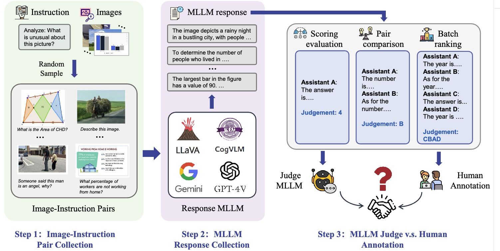
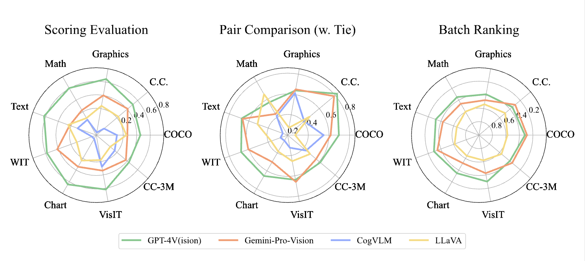

<div align="center">
<h1>MLLM-as-a-Judge:
Assessing Multimodal LLM-as-a-Judge with Vision-Language Benchmark</h1>

[](https://arxiv.org/abs/2402.04788)
[](https://huggingface.co/datasets/shuaishuaicdp/MLLM-Judge)




<p align="center">

</p>
</div>

## Updates & News
**Due to the potential deadlines from NeurIPS and EMNLP, our newly added dataset and code will be released in a few weeks. Thanks for your patience.**
- [01/05/2024] :moon: Our paper is accepted by ICML 2024! 
- [20/03/2024] :star: We release our complete dataset with guidelines and scripts for benchmarking current VLMs!
- [14/02/2024] :page_facing_up: We release our paper on [Arxiv](http://arxiv.org/abs/2402.04788) today!
  
## Contents
- [Updates \& News](#updates--news)
- [Contents](#contents)
- [Benchmark:MLLM-as-a-Judge](#benchmarkmllm-as-a-judge)
- [Benchmark mainstream MLLMs](#benchmark-mainstream-mllms)
  - [Collect Judgments from MLLMs](#collect-judgments-from-mllms)
    - [GPT-4V(ision)](#gpt-4vision)
    - [LLaVA](#llava)
    - [Gemini](#gemini)
    - [CogVLM](#cogvlm)
    - [Other MLLMs](#other-mllms)
  - [Data Cleaning](#data-cleaning)
  - [Calculate the final scores](#calculate-the-final-scores)
- [How to benchmark your MLLMs](#how-to-benchmark-your-mllms)
- [Contributing](#contributing)
- [Acknowledgements](#acknowledgements)
- [Citation](#citation)
  
## Benchmark:MLLM-as-a-Judge
This benchmark is structured into three main components: images, the main dataset, and sub-datasets. The arrangement is as follows:

```markdown
/MLLM-Judge
├── Figures (images for github repository)
├── Datasets
│   └── MLLM-as-a-Judge
│       ├── step1
│       ├── step2
│       ├── step3
│       └── Human Annotation
└── Hard & HQ
    ├── Hard
    └── HQ
```

1. **Figures**: Contains images for the GitHub repository. These images are used to illustrate and explain the contents of the repository, aiding users in better understanding the project.

2. **Datasets/MLLM-as-a-Judge**: This part of the dataset is developed in three steps, mirroring the structure outlined in our article. It includes MLLM outputs under three different settings: Scoring Evaluation, Pair Comparison, and Batch Ranking. Additionally, this section encompasses human annotation results and agreement data. In Scoring Evaluation, we also include responses data in a verbose setting for our ablation study.
   - **Benchmark**: The Final dataset with human annotations used as a benchmark to assess model performance. These annotations provide a reliable reference to verify if the model's judgments align with human evaluations.
   - **step1**: Contains original image-instruction pairs selected from 10 datasets. This is the starting point for data processing and model training, containing the initial input data.
   - **step2**: Contains response data generated by four different MLLMs. This step aims to enrich the dataset and increase its diversity by generating data through multiple models.
   - **step3**: Divides the data from step2 into three parts, each under different settings, containing responses from various MLLM Judges. This helps analyze and compare the performance differences across models under the same tasks.
   

3. **Hard & HQ**: Contains two specially curated datasets for specific data analysis and model training purposes:
   - **Hard**: Includes samples considered difficult under three different settings. This data is used to test and improve MLLM capabilities in dealing with complex scenarios.
   - **HQ (High Quality)**: Contains samples where the MLLM-as-a-Judge performed well. These high-quality samples help understand under what conditions the model performs best.

4. **Images**: All images utilized in our study are contained in this section. You can download all images in [google drive](https://drive.google.com/file/d/1z509Wr5f3vXxDbkiCj62mdclEkeMCPx4/view?usp=sharing) and extracted to the specified path (`<your path>/MLLM-Judge/`). 

Our comprehensive dataset and benchmarks are crafted with the aim of contributing to the development of stronger and more reliable MLLM-as-a-Judge systems in the future.

## Benchmark mainstream MLLMs

### Collect Judgments from MLLMs
#### GPT-4V(ision)
You can run the following script in shell to collect GPT-4V's judgement:
```shell
# Batch evaluation in No COT settings
python gpt4_judge.py --input_json '<your_path>/MLLM-Judge/Dataset/Benchmark/Batch.jsonl' --output_json './Batch.jsonl'  --image_root '<your_path>/MLLM-Judge/images' --evaluate 'Batch' --setting 'No COT'
# Score evaluation in No COT settings
python gpt4_judge.py --input_json
'<your_path>/MLLM-Judge/Dataset/Benchmark/Score.jsonl' --output_json './Score.jsonl'  --image_root '<your_path>/MLLM-Judge/images' --evaluate 'Score' --setting 'No COT'
# Pair Comparison in No COT settings
python gpt4_judge.py --input_json
'<your_path>/MLLM-Judge/Dataset/Benchmark/Pair.jsonl' --output_json './Pair.jsonl'  --image_root '<your_path>/MLLM-Judge/images' --evaluate 'Pair' --setting 'No COT'
```
#### LLaVA
You should first follow instructions in [LLaVA's repository](https://github.com/haotian-liu/LLaVA) to download llava-v1.5-13b and create a new python environment called LLaVA. Then, you need to move `\scripts\llava_inference.py` to `<your path>/LLaVA` and move to the `<your path>/LLaVA`. Then, you can run the following to produce MLLM's judging result:
```shell
# Batch evaluation in No COT settings
python llava_judge.py --input_json '<your_path>/MLLM-Judge/Dataset/Benchmark/Batch.jsonl' --output_json './Batch.jsonl'  --image_root '<your_path>/MLLM-Judge/images' --evaluate 'Batch' --setting 'No COT'
# Score evaluation in No COT settings
python llava_judge.py --input_json
'<your_path>/MLLM-Judge/Dataset/Benchmark/Score.jsonl' --output_json './Score.jsonl'  --image_root '<your_path>/MLLM-Judge/images' --evaluate 'Score' --setting 'No COT'
# Pair Comparison in No COT settings
python llava_judge.py --input_json
'<your_path>/MLLM-Judge/Dataset/Benchmark/Pair.jsonl' --output_json './Pair.jsonl'  --image_root '<your_path>/MLLM-Judge/images' --evaluate 'Pair' --setting 'No COT'
```
#### Gemini
You should first register your google account to get a Gemini-Pro API or run the script in Colab Pro.
To collect judging results from Gemini-Pro-Vision, you should run the following scripts in shell:
```shell
# Batch evaluation in No COT settings
python gemini_judge.py --api 'your_api' --input_json '<your_path>/MLLM-Judge/Dataset/Benchmark/Batch.jsonl' --output_json './Batch.jsonl'  --image_root '<your_path>/MLLM-Judge/images' --evaluate 'Batch' --setting 'No COT'
# Score evaluation in No COT settings
python gemini_judge.py --api 'your_api' --input_json '<your_path>/MLLM-Judge/Dataset/Benchmark/Score.jsonl' --output_json './Score.jsonl'  --image_root '<your_path>/MLLM-Judge/images' --evaluate 'Batch' --setting 'No COT'
# Pair Comparison in No COT settings
python gemini_judge.py --api 'your_api' --input_json '<your_path>/MLLM-Judge/Dataset/Benchmark/Pair.jsonl' --output_json './Pair.jsonl'  --image_root '<your_path>/MLLM-Judge/images' --evaluate 'Batch' --setting 'No COT'
```
Notice: If you run Gemini in your local environment, the inference limitation is very severe, reaching only 60 QPM.
#### CogVLM
You should follow the instruction in [CogVLM's repository](https://github.com/THUDM/CogVLM) to download CogVLM checkpoint. Then, you should move `scripts/cogvlm_judge.py` to `<your_path>/CogVLM` to collect judgment from CogVLM, using the following scripts in shell:
```shell
# Score evaluation in No COT settings
python cogvlm_judge.py --api 'your_api' --input_json '<your_path>/MLLM-Judge/Dataset/Benchmark/Score.jsonl' --output_json './Score.jsonl'  --image_root '<your_path>/MLLM-Judge/images' --evaluate 'Batch' --setting 'No COT'
# Pair Comparison in No COT settings
python cogvlm_judge.py --api 'your_api' --input_json '<your_path>/MLLM-Judge/Dataset/Benchmark/Pair.jsonl' --output_json './Pair.jsonl'  --image_root '<your_path>/MLLM-Judge/images' --evaluate 'Batch' --setting 'No COT'
```
Notice: CogVLM cannot follow our output template in Batch Evaluation setting.
#### Other MLLMs
We also benchmark our MLLM-as-a-Judge on GLM-4V and minicpm-v. However, they cannot follow the output template or inherent a huge bias in judging and excluded in our experiments.

### Data Cleaning
After collecting all judgments, you should clean their answer and only remains the judgments. You can run the `clean_data.py` in `scripts/`.

### Calculate the final scores
After data cleaning process, you can run the `calculate.py` in `scripts/` and collect the final scores in *Batch Evaluation, Score Evaluation, Pair Comparison* settings in the following template:
```shell
```
## How to benchmark your MLLMs
You can also benchmark your own MLLMs following the template we present for these four mainstream VLMs by inference-clean-calculate process.

## Contributing
Contributions to this project are welcome. Please consider the following ways to contribute:

- Reporting issues
- Proposing new features or improvements
- Benchmark other mainstream MLLMs
  
## Acknowledgements

This project is based on the findings and methodologies presented in the paper [LLM-as-a-Judge](https://arxiv.org/abs/2306.05685) and [HallusionBench](https://arxiv.org/abs/2310.14566).

## Citation

```
@misc{chen2024mllmasajudge,
      title={MLLM-as-a-Judge: Assessing Multimodal LLM-as-a-Judge with Vision-Language Benchmark}, 
      author={Dongping Chen and Ruoxi Chen and Shilin Zhang and Yinuo Liu and Yaochen Wang and Huichi Zhou and Qihui Zhang and Pan Zhou and Yao Wan and Lichao Sun},
      year={2024},
      eprint={2402.04788},
      archivePrefix={arXiv},
      primaryClass={cs.CL}
}
```